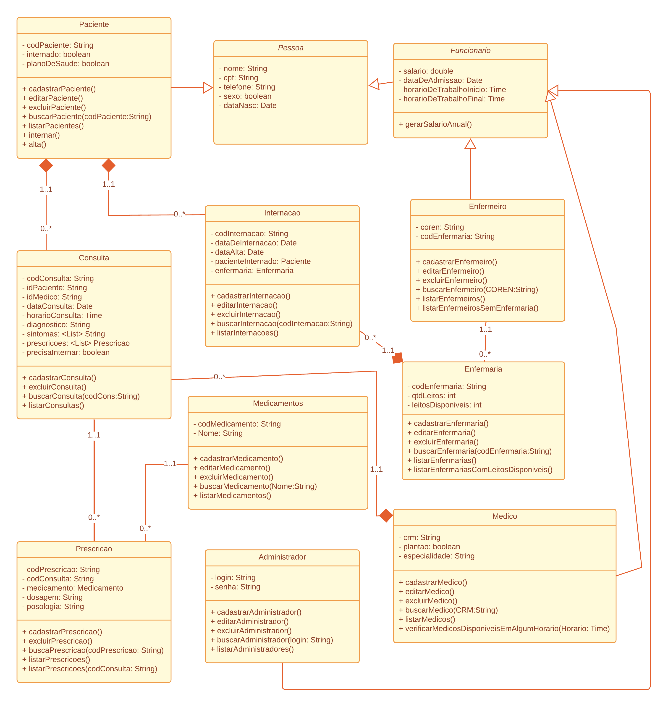

# Sistema de Gerenciamento Hospitalar

## Tópicos
- [Sistema de Gerenciamento Hospitalar](#sistema-de-gerenciamento-hospitalar)
  - [Tópicos](#tópicos)
  - [Descrição](#descrição)
  - [Funcionalidades](#funcionalidades)
  - [Diagrama de Classes](#diagrama-de-classes)
  - [Requisitos](#requisitos)
  - [Instalação](#instalação)
  - [Equipe de Desenvolvimento](#equipe-de-desenvolvimento)
  - [Licença](#licença)

## Descrição

O Sistema de Gerenciamento Hospitalar é um projeto desenvolvido para facilitar a administração de um hospital. Ele permite o cadastro de pacientes, médicos, enfermeiros. Permite também cadastro de consultas realizadas e internações.

## Funcionalidades

- Cadastro de administradores, pacientes, médicos, enfermeiros, enfermarias e medicamentos
- Agendamento de consultas
- Internações
- Gerenciamento de leitos
- Prescrição de medicamentos
- Geração de relatórios

## Diagrama de Classes



## Requisitos

Para executar o Sistema de Gerenciamento Hospitalar, você precisará garantir que o seguinte esteja instalado em seu ambiente:

- **Java 8 ou superior**: O sistema foi desenvolvido em Java, portanto, certifique-se de ter o Java Development Kit (JDK) instalado em sua máquina. Você pode baixá-lo e instalá-lo a partir do [site oficial da Oracle](https://www.oracle.com/java/technologies/javase-downloads.html).

- **Banco de dados SQLite e suas dependências**: O sistema utiliza o banco de dados SQLite para armazenar e gerenciar os dados. Certifique-se de ter o SQLite instalado em seu sistema. Você pode encontrar mais informações sobre como instalar o SQLite em diferentes plataformas [aqui](https://www.sqlite.org/download.html).

## Instalação

Siga as etapas abaixo para instalar e executar o Sistema de Gerenciamento Hospitalar em seu ambiente:

1. **Clone o repositório**: Use o comando abaixo para clonar o repositório para o seu ambiente local:

    ```bash
    git clone [URL do repositório]
    ```

2. **Importe o projeto em sua IDE**: Abra sua IDE preferida e importe o projeto clonado.

3. **Ajuste as dependências do Banco de Dados**:
    - Se estiver utilizando o Visual Studio Code, siga as instruções abaixo para ajustar as dependências do banco de dados SQLite:
        - Dentro da pasta `.vscode` no projeto, crie um arquivo `settings.json` (se já não existir).
        - Adicione o seguinte conteúdo ao arquivo `settings.json` com as versões correspondentes dos arquivos JAR presentes na pasta `lib` do projeto:

        ```json
        {
            "java.project.referencedLibraries": [
                "src/lib/sqlite-jdbc-3.45.2.0.jar",
                "src/lib/slf4j-api-2.0.12.jar"
            ]
        }
        ```

4. **Execute o arquivo `Main.java`**: Após ajustar as dependências e configurar o projeto em sua IDE, execute o arquivo `Main.java` para iniciar o sistema.

## Equipe de Desenvolvimento

- Jhoan Fernandes de Oliveira 
- João Augusto Câmara Neto 
- Luis Felipe Lima Tomaz 
- Murilo Lacerda de Souza Fontes 

## Licença

Este projeto está licenciado sob a [MIT License](LICENSE).